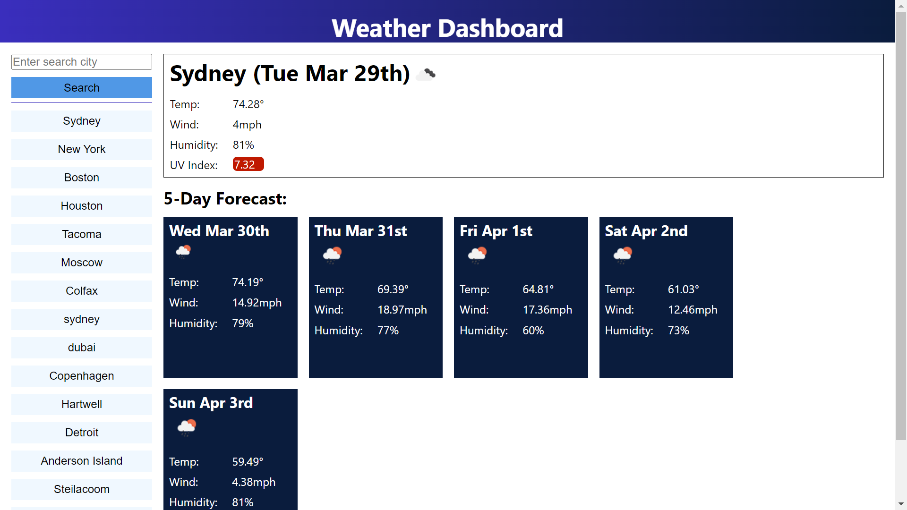
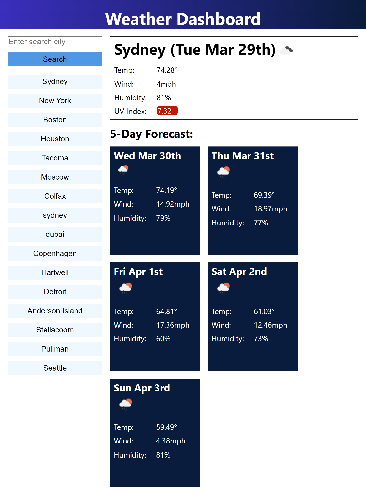

# open-weather-app

# Description

This project is a weather app. Users can search for a specific city location and see the weather for that day, as well as a five day forecast. 

## About

Users can search to retrieve weather data specific to a city location. Searched cities are saved as favorites for more convienient access later. Data presented includes an icon representation of the weather conditions, temperature, wind speed, humidity, and UV index(current day only). The UV index includes color scaling relative to the intensity. 

UV Index         

    UV Index Value | Exposure | Color Code

    2 or less        low         Green

    3 to 5           moderate    Yellow
    
    6 to 7           high        Orange
    
    8 to 10          very high   Red

## Appearance

### Single Page Application

## View the project

Navigate to [open-weather-app](https://levisgaragegroupinc.github.io/open-weather-app/) to view the live page. 

## Credits

This project uses:

 - Moment.js version 2.29.1 [moment.js.com](https://momentjs.com/) 

 - OpenWeather API [openWeather](https://openweathermap.org/)

 Mocks for the layout and color scheme were provided by the University of Washington full stack programming course. 